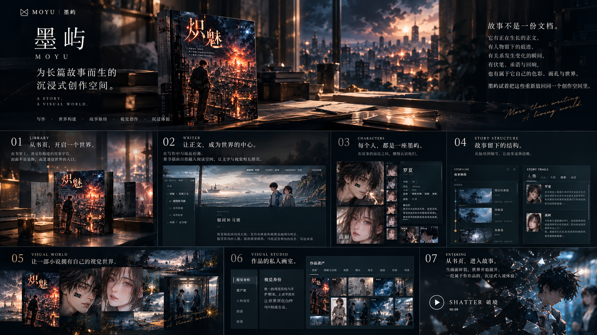
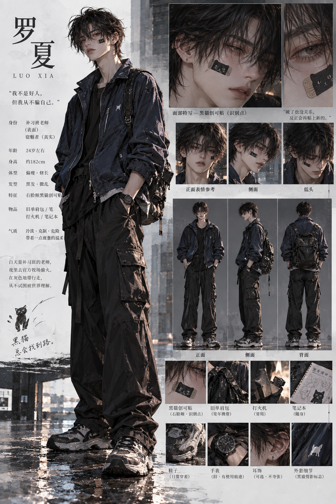

<div align="center">

# 墨屿 · MOYU

**A private writing studio for long-form stories.**

<br>


<br><br>

### 为长篇故事而生。

写作 · 故事结构 · 人物世界 · 视觉创作 · 沉浸体验

</div>

<br>

---

<br>

## 从书页，进入一个世界。

作品不只是一份文档。正文、人物、故事结构与视觉世界，在同一处创作空间里相遇。

<p align="center">
  <a href="./assets/moyu-beta1-overview.png"></a>
</p>

<br>

## 人物，拥有自己的样子。

《炽魅》的高妍与罗夏。人物设定与视觉形象，共同留存在作品中。

<table>
  <tr>
    <td width="50%" align="center"><a href="./assets/gaoyan-character.png"></a></td>
    <td width="50%" align="center"><a href="./assets/luoxia-character.png"></a></td>
  </tr>
  <tr>
    <td align="center"><sub>高妍 · GAO YAN</sub></td>
    <td align="center"><sub>罗夏 · LUO XIA</sub></td>
  </tr>
</table>

<p align="center"><sub>点击图片，查看完整视觉设定。</sub></p>

<br>

---

<br>

## MOYU Beta 1

墨屿是一款面向长篇故事创作的桌面写作软件。

正文、人物、故事结构与视觉资产，共同存在于一部作品里。

```text
WRITING       Writer · Auto Save · Draft Journal · Recovery
STORY         Volume · Chapter · Scene · Thread · Beat · Promise · Echo
CHARACTER     Profile · Relationship · Arc · Evidence · Primary Visual
TIMELINE      Reading Order · Story Time
VISUAL        Visual Identity · Illustration · Cover · Chapter Cinema · Roam
ENTERING      STILL · SHATTER · Epigraph · Sound
```

<br>

## Architecture

```text
┌─────────────────────────────────────────────────────────────┐
│                         MOYU                                │
├─────────────────────────────────────────────────────────────┤
│  Library        Writer        Creative        Visual        │
├─────────────────────────────────────────────────────────────┤
│  Character      Story         Timeline        Entering      │
├─────────────────────────────────────────────────────────────┤
│                  Domain / Application                       │
├─────────────────────────────────────────────────────────────┤
│          SQLite · Draft Journal · Recovery                  │
├─────────────────────────────────────────────────────────────┤
│                Electron · CodeMirror 6                      │
└─────────────────────────────────────────────────────────────┘
```

**Local-first. Recovery-first. Plain-text-first.**

项目与正文保存在本地。写作不依赖在线服务，并提供 Draft Journal、备份与 `.moyu` 恢复链路。

<br>

## AI stays behind the author.

**墨屿不会替作者写小说。**

AI 在 Beta 1 中主要参与视觉生成。故事与正文始终来自作者。

<br>

---

<div align="center">

## MOYU Beta 1

**Windows x64 · v0.9.0-beta.1**

[GitHub Release](https://github.com/ltfxhxh/moyu-releases/releases/tag/v0.9.0-beta.1)
&nbsp;&nbsp;·&nbsp;&nbsp;
[GitCode](https://gitcode.com/lvtengfei/moyu-releases)

<br>

`SHA256  daa5fbae9dbcc890515a5397dd38dd60249372a61eed46c1975f78529831e3d8`

<br>

<sub>MOYU · 墨屿 / Beta 1</sub>

</div>
